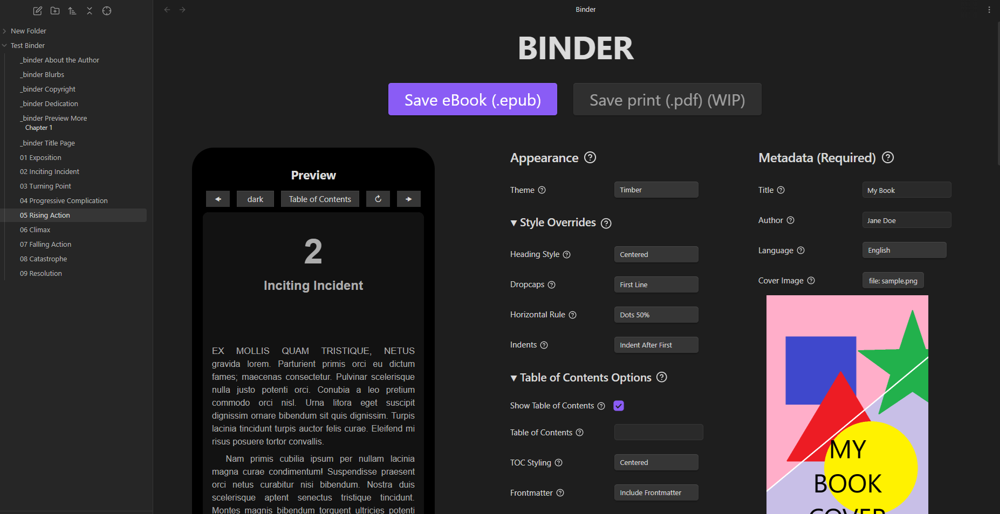
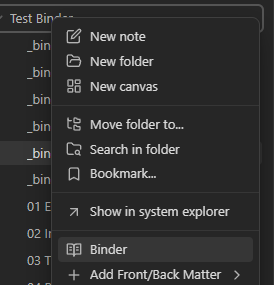
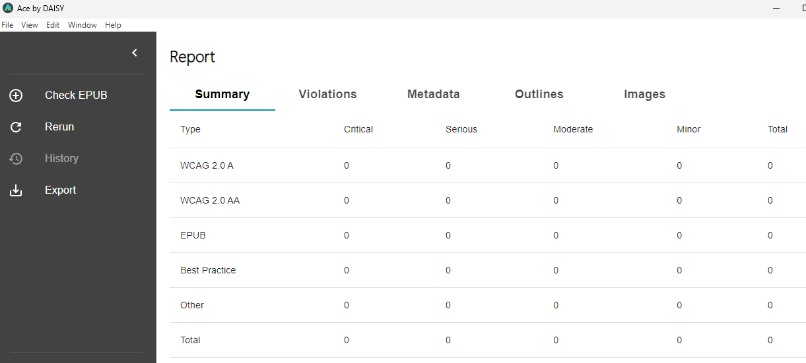

# Obsidian Binder

Obsidian Binder is an Obsidian plugin that allows users to effortlessly turn their files into a professional-quality, well-formatted, beautiful eBooks. This plugin also includes pre-made templates for front and back matter to streamline the export process.

The primary format is ePub 3.0, targeted for export to the Amazon Kindle store.

## Table of Contents

* [Usage](#usage)
   + [Binding](#binding)
   + [Rearrange Chapters](#rearrange-chapters)
   + [Templates](#templates)
   + [Customize Styling (Advanced CSS)](#customize-styling-advanced-css)
   + [Accessibility](#accessibility)
* [Installing](#installing)
* [Development](#development)

## Usage

### Binding



1. Right click on folder to bind, select Binder.
2. Fill in the options.
3. Save.

You can check your output file with [Kindle Previewer 3](https://kdp.amazon.com/en_US/help/topic/G202131170) or [Calibre](https://calibre-ebook.com/).

It should show that all metadata are correctly filled out.


### Rearrange Chapters

Drag and drop.


### Templates


1. Right click on folder.
2. Add Front/Back matter.

These will be created with prefixed text. There will be a list of properties at the top of the page, with explanations for how to fill them out below.

For example, this is the copyright template:


Which renders:


### Customize Styling (Advanced CSS)

Customize styling of portions of your book by creating a code element (tab) with your desired CSS, like this:

```
%BINDER CSS% text-align: center;
```

Your style is reset every time the binder encounters one of these. So, in order to reset your formatting, you can simply add an empty one:

```
%BINDER CSS%
```

Here is an example:


Which renders:


### Accessibility

The epub creator has been checked for accessibility standards.



However, you can still create an epub with standard violations (eg. if you have heading jumps). To ensure there are no errors, double check with [ACE by Daisy](https://daisy.org/activities/software/ace/).

## Installing

1. **Install the Plugin**:
   - (Recommended) If installing through Obsidian, go to Settings > Community plugins > Browse and search for "Binder".
   - If downloading manually, place the plugin files in your Obsidian plugins folder.
2. **Enable the Plugin**: Go to Settings > Community plugins, find "Binder" and toggle it on.

## Development

If you want to contribute or modify the plugin, follow these steps:

- Clone this repo.
- Make sure your NodeJS is at least v16 (`node --version`).
- `npm i` or `yarn` to install dependencies.
- `npm run dev` to start compilation in watch mode.
- Feel free to file a pull request with any improvements.
